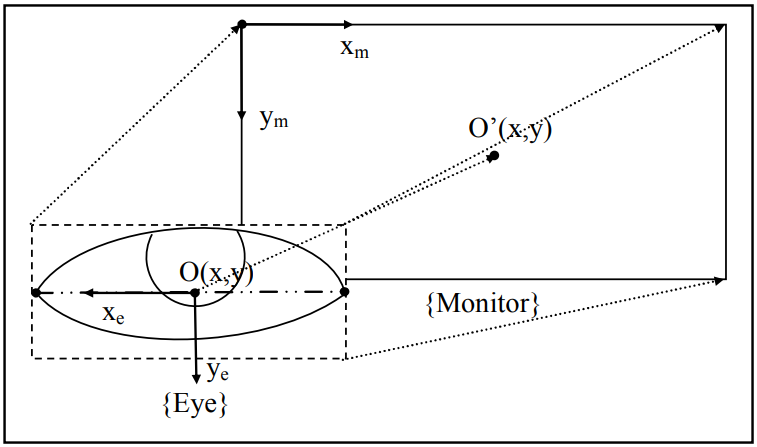

# HIGHLY_Inaccurate-gaze-estimator

## Required Packages: 
The code was developed with the all the latest packages of that time. Following are list of packages used and their corresponding versions.
1. opencv-python--version==4.4.0.46
2. matplotlib--version==3.3.3
3. numpy--version==1.19.3

Note: numpy--version==1.19.4 was the latest version back then though it had runtime errors in Windows 10 environment and the possible solution was to be released in the upcoming version (as per some articles online). 

## Execution:
1. Simply run the code by typing python3 EyeGazeTracker.py in terminal or run in any of the IDEs.
2. Provided the face is fully visible in the camera, the code successfully detects the face and the eyes.
3. Adjust the track bar to set the threshold value to enable pupil detection. The value usually is in between 30-100 depending upon the ambient light and illumination.

## After Having Pupil Coordinates, Eye Image, Screen Dimentions and Distance from Face to Screen

  

O(x,y) is the center of eye image
O'(x,y) is the center of the screen

## Scaling Factors are defined as:

  

  

where 'd' is the distance between the user and the screen.
Note: We can obtain this value with the help of depth component from a RGBD camera or just define some value. 

## Gaze Estimation:

  

  

where;
x_i and y_i are pupil coordinates in the eye image
x_m and x_m are estimated position on the screen

## References:
1. N. H. Cuong and H. T. Hoang, "Eye-gaze detection with a single WebCAM based on geometry features extraction," 2010 11th International Conference on Control Automation Robotics & Vision, Singapore, 2010, pp. 2507-2512, doi: 10.1109/ICARCV.2010.5707319.
2. OpenCV Tutorials

